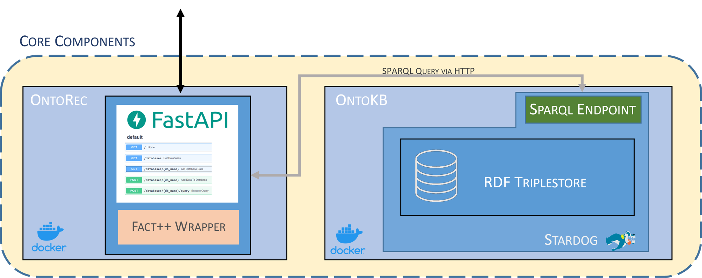

# OntoTransCoreComponents
This repository contains the OntoTrans WP3 development.

## Content
* [Overview](#overview)
* [Deployment](#deployment)
    * [Run with docker-compose](#run-with-docker-compose)
* [OntoREC API](#available-ontorec-apis)


## Overview 
Here is the overview of the architecture proposed by WP3 about its two main components: OntoKB and OntoREC.\
The core of OntoKB is Stardog, a triplestore, in which stores the knowledge like application ontologies, individuals and meta-data.\
OntoRec is currently envisioned as a general access point to OntoKB functionalities which interface itself with the Stardog SPARQL endpoint in order to provide an abstraction of the db to the user.



## Deployment
Both OntoKB and OntoRec are deployed as containerized services.

## Create network

Both OntoKB and OntoRec needs to share the same network to be addressable by name
```
docker network create -d bridge corecomponentsnetwork
```

## Run Stardog
The stardog image is the official one present in DockerHub
```
docker run \
    -d \
    --name stardog \
    -it \
    --network corecomponentsnetwork \
    -v <LICENSE FOLDER>:/var/opt/stardog \
    -p 5820:5820 \
    stardog/stardog
```

In order to work Stardog require a volume pointing to the folder which contains the license. Make sure to put the correct path in the command above.

## Run OntoREC
The image of OntoRec is present on the official gitlab [container registry](https://gitlab.cc-asp.fraunhofer.de/ontotrans/ontotranscorecomponents/container_registry) of the project
```
docker run \
    --name ontorec \
    --rm \ 
    -i \ 
    -d \ 
    --network corecomponentsnetwork \
    -p 80:80 \
    registry.gitlab.cc-asp.fraunhofer.de/ontotrans/ontotranscorecomponents/ontorec
```

## Run with docker compose
Alternatively, you can use the provided [docker-compose.yml](docker-compose.yml) file

## Available OntoREC APIs
Here is a brief list of the available APIs provided by OntoREC
|METHOD|ENDPOINT|DESCRIPTION|
|---|---|---|
|GET|/databases|Get the list of all available databases|
|GET|/databases/{db_name}|Get all the triples contained into the DB|
|POST|/databases/{db_name}/query|Submit a query as a string to a specific database|
|POST|/databases/{db_name}/create|Create the database|
|POST|/databases/{db_name}|Add ontology to existing database |
|DELETE|/databases/{db_name}|Delete an existing database |

More information can be found on the Redoc of OntoREC instance: http://localhost:80/redoc